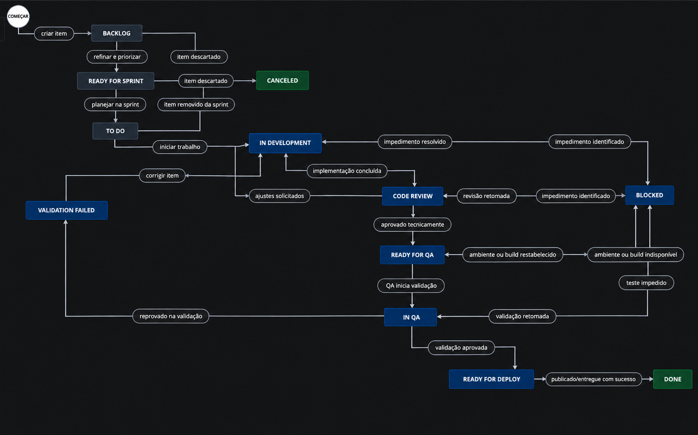

# Planejamento do Fluxo de Trabalho

## Contexto do projeto

Este documento define o fluxo de trabalho do projeto **Swag Labs Shopping**, desenvolvido como parte do curso **O dia a dia de um QA: a prática de testes manuais funcionais**.

O projeto utiliza como base o site **Swag Labs**, uma loja virtual simplificada e bastante usada para prática de testes. A proposta é simular o acompanhamento de um projeto web em um time ágil, documentando as decisões de qualidade, os fluxos de trabalho e, nas próximas etapas, histórias de usuário, cenários, casos de teste, execução e evidências.

## Por que definir um fluxo de trabalho?

Fluxos e status de trabalho são formas que a equipe encontra para se comunicar e entender o processo de implementação durante a sprint.

Os status representam em qual etapa um item está no momento. As transições indicam os caminhos possíveis entre esses status e normalmente acontecem a partir de gatilhos, como início do desenvolvimento, envio para QA, reprovação em teste, resolução de impedimento ou conclusão da entrega.

Como QA, definir esse fluxo é importante porque também precisamos pensar no ciclo de vida do bug. Quando uma falha é encontrada, o time precisa saber como registrar, priorizar, corrigir, revalidar e encerrar esse item. Por isso, o fluxo deve ser acordado com a equipe e precisa representar bem a forma como o trabalho será realizado.

## Fluxo proposto para o projeto

O fluxo abaixo foi definido pensando em um quadro Scrum no JIRA, com etapas suficientes para acompanhar histórias, tasks e bugs.

### Status do quadro

No JIRA, cada status precisa estar associado a uma categoria. Essa categoria ajuda o quadro a entender se o item ainda não começou, se está em andamento ou se já foi encerrado.

| Categoria do JIRA | Cor padrão | Significado |
| --- | --- | --- |
| A fazer | Cinza | O item ainda não foi iniciado ou ainda está aguardando priorização, refinamento ou planejamento. |
| Fazendo | Azul | O item está em andamento, em desenvolvimento, validação, revisão, correção ou bloqueado por algum impedimento. |
| Feito | Verde | O item foi concluído, entregue ou encerrado. |

### Mapeamento dos status no JIRA

| Status | Categoria do JIRA | Cor | Responsável principal | Objetivo |
| --- | --- | --- | --- | --- |
| Backlog | A fazer | Cinza | Product Owner / Time | Registrar demandas ainda não priorizadas para a sprint. |
| Ready for Sprint | A fazer | Cinza | Product Owner / Time | Indicar que a demanda foi refinada e pode entrar na sprint. |
| To Do | A fazer | Cinza | Time | Indicar que o item foi selecionado para a sprint, mas ainda não foi iniciado. |
| In Development | Fazendo | Azul | Desenvolvimento | Implementar uma demanda ou corrigir um problema. |
| Code Review | Fazendo | Azul | Desenvolvimento | Revisar a implementação antes de liberar para validação. |
| Ready for QA | Fazendo | Azul | Desenvolvimento / QA | Indicar que o item está pronto para validação funcional. |
| In QA | Fazendo | Azul | QA | Executar testes funcionais, exploratórios e de aceite. |
| Validation Failed | Fazendo | Azul | QA / Desenvolvimento | Indicar que a demanda foi reprovada na validação e precisa de correção. |
| Blocked | Fazendo | Azul | Qualquer membro do time | Indicar impedimento que bloqueia a continuidade do trabalho. |
| Ready for Deploy | Fazendo | Azul | QA / Desenvolvimento | Indicar que o item foi validado e pode ser publicado. |
| Done | Feito | Verde | Time | Indicar que o item foi entregue com sucesso. |
| Canceled | Feito | Verde | Product Owner | Indicar que o item foi encerrado porque não será mais trabalhado. |

O status `Blocked` permanece na categoria **Fazendo** porque o item ainda não foi finalizado; ele apenas está impedido de continuar até que o bloqueio seja resolvido. O status `Canceled` fica na categoria **Feito** porque representa um encerramento do item, mesmo que ele não tenha sido entregue em produção.

## Diagrama de estados e transições

## Regras de transição

### Backlog para Ready for Sprint

A transição deve acontecer quando a demanda estiver refinada, compreendida pelo time e possuir informações mínimas para desenvolvimento e teste.

- descrição clara do problema ou necessidade
- critério de aceite definido
- prioridade informada

### Ready for Sprint para To Do

A transição ocorre durante o planejamento da sprint, quando o item é selecionado para ser trabalhado.

- item priorizado pelo Product Owner
- estimativa discutida pelo time
- capacidade da sprint considerada
- riscos conhecidos registrados

### To Do para In Development

A transição ocorre quando a pessoa desenvolvedora inicia o trabalho.

- item atribuído
- entendimento do requisito confirmado
- ambiente de desenvolvimento disponível

### In Development para Code Review

A transição ocorre quando a implementação foi finalizada e precisa de revisão técnica.

- código implementado
- testes básicos realizados pela pessoa desenvolvedora
- critérios de aceite considerados
- pull request ou revisão técnica disponível, quando aplicável

### Code Review para Ready for QA

A transição ocorre quando a implementação foi aprovada tecnicamente e está disponível para validação.

- revisão de código aprovada
- item publicado em ambiente de teste
- instruções de teste informadas, se necessário

### Ready for QA para In QA

A transição ocorre quando o QA inicia a validação funcional.

- ambiente de teste acessível
- massa de dados disponível
- história, task ou bug com critérios de aceite claros
- versão/build identificada

### In QA para Validation Failed

A transição ocorre quando o QA reprova a demanda durante a validação funcional.

- comportamento atual diferente do esperado
- evidência anexada, passos para reproduzir, resultado esperado e resultado obtido descritos
- severidade e prioridade sugeridas, quando aplicável.

### Validation Failed para In Development

A transição ocorre quando a demanda reprovada retorna para correção.

- defeito aceito pelo time
- responsável definido
- informações suficientes para reproduzir a falha

### In QA para Ready for Deploy

A transição ocorre quando o QA aprova a validação funcional.

- critérios de aceite atendidos
- casos de teste planejados executados
- bugs críticos ou impeditivos inexistentes
- evidências registradas
- validação de regressão realizada, quando necessário

### Ready for Deploy para Done

A transição ocorre quando o item foi entregue com sucesso.

- deploy realizado ou entrega aceita
- item validado no ambiente combinado
- documentação atualizada, quando necessário
- Product Owner ou pessoa responsável ciente da entrega.

### Qualquer status ativo para Blocked

A transição ocorre quando existe um impedimento que bloqueia o andamento do item.

- ambiente indisponível
- requisito incompleto
- dependência de outro time
- erro que impede a continuidade dos testes
- dúvida de negócio sem resposta.

### Status iniciais para Canceled

A transição ocorre quando o item não será mais trabalhado.

- requisito deixou de fazer sentido
- demanda duplicada
- decisão registrada pelo Product Owner.

## Campos recomendados para os itens no JIRA

Para apoiar o fluxo de trabalho e a rastreabilidade dos testes, os itens devem possuir campos mínimos.

### Campos gerais

| Campo | Finalidade |
| --- | --- |
| Tipo do item | Identificar se é história, task, bug, melhoria. |
| Título | Resumir a demanda de forma objetiva. |
| Descrição | Explicar contexto, necessidade e comportamento esperado. |
| Prioridade | Apoiar a ordenação do backlog e da sprint. |
| Responsável | Indicar quem está atuando no item. |
| Sprint | Relacionar o item ao ciclo de trabalho. |
| Epic | Agrupar demandas relacionadas. |
| Critérios de aceite | Definir condições para considerar o item aceito. |
| Ambiente | Informar onde o item deve ser validado. |
| Versão/Build | Registrar a versão testada. |

### Campos importantes para QA

| Campo | Finalidade |
| --- | --- |
| Evidências | Anexar prints, vídeos, logs ou observações de teste. |
| Casos de teste relacionados | Rastrear quais testes validam o item. |
| Resultado da validação | Indicar aprovado, reprovado ou bloqueado. |
| Severidade | Informar o impacto técnico ou funcional de uma falha. |
| Prioridade do bug | Informar urgência de correção para o negócio. |
| Passos para reproduzir | Permitir que o time reproduza o problema. |
| Resultado esperado | Descrever o comportamento correto. |
| Resultado obtido | Descrever o comportamento observado. |

## Papel do QA no fluxo

O QA participa do processo desde o refinamento até a entrega final.

Responsabilidades principais:

- apoiar o entendimento dos requisitos
- identificar riscos e cenários críticos
- questionar ambiguidades nos critérios de aceite
- planejar cenários e casos de teste
- executar diferentes tipos de testes
- registrar evidências
- reportar bugs de forma clara e reproduzível
- validar correções