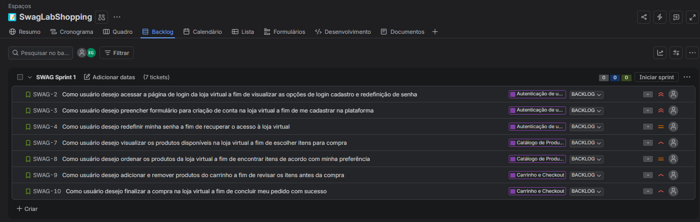

# Histórias de Usuário

## Contexto

Este documento reúne épicos e histórias de usuário planejados, com base no site [Sauce Demo](https://www.saucedemo.com/) e na proposta de engenharia reversa.

O objetivo é praticar a escrita de histórias de usuário, então algumas funcionalidades foram imaginadas a partir do protótipo de loja virtual, mesmo que não existam atualmente no site oficial. Esse é o caso das opções de criação de conta e redefinição de senha, que ajudam a exercitar a análise do fluxo de autenticação sob a visão do usuário.

As histórias foram organizadas para uso no JIRA e documentação no repositório, mantendo épico relacionado, valor, narrativa do usuário, requisitos e critérios de aceite em checklist e BDD/Gherkin.

## Base conceitual

Histórias de usuário são uma forma de estruturar requisitos a partir da visão do usuário. Em vez de descrever apenas uma solução técnica, a história busca responder quem é o usuário, o que esse usuário deseja e por que essa necessidade é importante.

A escrita das histórias segue a estrutura:

```text
Como [tipo de usuário]
Eu quero [objetivo]
Para [benefício ou valor esperado]
```

Também foi considerado o princípio **3C**:

- **Cartão:** registro resumido da necessidade;
- **Conversa:** discussão com o time para detalhar e refinar a história;
- **Confirmação:** critérios de aceite que indicam quando a história pode ser considerada atendida.

Além disso, as histórias foram avaliadas com base no conceito **INVEST**: independente, negociável, valiosa, estimável, pequena e testável.

## Épicos planejados

| Código | Nome do épico | Quantidade de histórias |
| --- | --- | --- |
| EPIC-001 | Autenticação de Usuário | 3 |
| EPIC-002 | Catálogo de Produtos | 2 |
| EPIC-003 | Carrinho e Checkout | 2 |

---

## EPIC-001 - Autenticação de Usuário

### Objetivo do épico

Centralizar as funcionalidades relacionadas ao acesso do cliente à loja virtual, incluindo login, criação de conta e redefinição de senha.

## US-001 - Como usuário desejo acessar a página de login da loja virtual a fim de visualizar as opções de login cadastro e redefinição de senha

### Valor

A autenticação de usuário na loja virtual é importante para que os clientes possam se cadastrar na plataforma com segurança e fazer pedidos. Essa funcionalidade visa unificar o fluxo de acesso ao site, permitindo que o usuário possa se cadastrar, fazer login ou redefinir a senha na loja virtual.

### Narrativa do usuário

**Como** cliente  
**Eu quero** acessar a página de login do usuário  
**Para** visualizar opções de login, cadastro e redefinição de senha na loja virtual

### Requisitos

- **Atores:** cliente.
- **Interfaces:** documento em anexo da UI/UX.
- **Dados:**
  - criação de banco de dados/tabelas para armazenar informações dos clientes cadastrados;
  - criação de API para integração com front-end e banco criado;
  - criação de tela de login para permitir que o usuário acesse a página de login e a página de cadastro do usuário.
- **Plataforma/Ambientes:**
  - Web / Web Mobile;
  - devem ser configurados ambientes e pipelines para desenvolvimento, homologação de usuário, homologação QA e produção.

### Critérios de aceite - Checklist

- Usuário deverá visualizar formulário para fazer login e entrar na loja virtual.
- Usuário deverá visualizar botão para acessar tela de cadastro do sistema.
- Usuário deverá visualizar botão para acessar tela "Esqueci minha senha".

### Critérios de aceite - BDD/Gherkin

```gherkin
Cenário: Cliente sem cadastro deseja criar uma conta
  Dado que o cliente esteja na tela de login
  E não esteja cadastrado no sistema
  Quando clicar em "criar conta"
  Então será redirecionado para uma tela de criação de nova conta
```

```gherkin
Cenário: Cliente sem cadastro tenta fazer login
  Dado que o cliente esteja na tela de login
  E adicione um username não cadastrado
  Quando clicar em "login"
  Então uma mensagem surgirá avisando que a conta não existe
```

```gherkin
Cenário: Cliente com cadastro informa dados incorretos de acesso
  Dado que o cliente esteja na tela de login
  E adicione um username correto
  Mas escreva uma senha incorreta
  Quando clicar em "login"
  Então uma mensagem surgirá avisando que a senha está incorreta
```

## US-002 - Como usuário desejo preencher formulário para criação de conta na loja virtual a fim de me cadastrar na plataforma

### Valor

A criação de conta permite que novos clientes se cadastrem na loja virtual para acessar a plataforma, realizar compras e manter seus dados vinculados ao perfil. Essa funcionalidade reduz a dependência de credenciais previamente fornecidas e amplia o fluxo de entrada de novos usuários.

### Narrativa do usuário

**Como** cliente sem cadastro  
**Eu quero** preencher um formulário para criação de conta  
**Para** me cadastrar na loja virtual e acessar a plataforma

### Requisitos

- **Atores:** cliente sem cadastro.
- **Interfaces:** tela de criação de conta.
- **Dados:**
  - username;
  - nome completo;
  - data de nascimento;
  - e-mail;
  - senha;
  - confirmação de senha.
- **Regras de negócio:**
  - campos obrigatórios devem ser validados;
  - e-mail deve possuir formato válido;
  - senha e confirmação de senha devem ser iguais;
  - não deve ser permitido criar conta com usuário ou e-mail já cadastrado.

### Critérios de aceite - Checklist

- Usuário deverá visualizar formulário de criação de conta.
- Usuário deverá preencher todos os campos obrigatórios.
- Sistema deverá validar formato de e-mail.
- Sistema deverá validar se senha e confirmação de senha são iguais.
- Sistema deverá impedir cadastro com usuário ou e-mail já existente.
- Sistema deverá exibir mensagem de sucesso após criação da conta.

### Critérios de aceite - BDD/Gherkin

```gherkin
Cenário: Cliente cria conta com dados válidos
  Dado que o cliente esteja na tela de criação de conta
  E preencha todos os campos obrigatórios com dados válidos
  Quando clicar em "criar conta"
  Então o sistema deverá criar o cadastro
  E exibir uma mensagem de sucesso
```

```gherkin
Cenário: Cliente informa senhas diferentes
  Dado que o cliente esteja na tela de criação de conta
  E preencha o campo senha
  Mas preencha a confirmação de senha com valor diferente
  Quando clicar em "criar conta"
  Então o sistema deverá impedir o cadastro
  E exibir mensagem informando que as senhas não conferem
```

## US-003 - Como usuário desejo redefinir minha senha a fim de recuperar o acesso à loja virtual

### Valor

A redefinição de senha permite que clientes recuperem o acesso à loja virtual de forma autônoma, reduzindo bloqueios no uso da plataforma e diminuindo a dependência de suporte para recuperação de conta.

### Narrativa do usuário

**Como** cliente cadastrado  
**Eu quero** redefinir minha senha  
**Para** recuperar o acesso à loja virtual caso eu esqueça meus dados de entrada

### Requisitos

- **Atores:** cliente cadastrado.
- **Interfaces:** tela de redefinição de senha.
- **Dados:**
  - e-mail cadastrado;
  - mensagem de confirmação;
  - link ou fluxo de redefinição de senha.
- **Regras de negócio:**
  - sistema deve solicitar um e-mail para iniciar a recuperação de senha;
  - e-mail informado deve ter formato válido;
  - sistema não deve expor dados sensíveis do usuário;
  - sistema deve informar se a solicitação foi registrada.

### Critérios de aceite - Checklist

- Usuário deverá visualizar a tela de redefinição de senha.
- Usuário deverá conseguir informar o e-mail cadastrado.
- Sistema deverá validar o formato do e-mail.
- Sistema deverá permitir solicitar redefinição quando o e-mail for válido.
- Sistema deverá exibir mensagem de confirmação após a solicitação.
- Sistema não deverá exibir dados sensíveis do usuário.

### Critérios de aceite - BDD/Gherkin

```gherkin
Cenário: Cliente solicita redefinição de senha com e-mail válido
  Dado que o cliente esteja na tela de redefinição de senha
  E informe um e-mail cadastrado e válido
  Quando clicar em "redefinir senha"
  Então o sistema deverá registrar a solicitação
  E exibir uma mensagem de confirmação
```

```gherkin
Cenário: Cliente solicita redefinição de senha com e-mail inválido
  Dado que o cliente esteja na tela de redefinição de senha
  E informe um e-mail em formato inválido
  Quando clicar em "redefinir senha"
  Então o sistema deverá impedir a solicitação
  E exibir mensagem informando que o e-mail é inválido
```

---

## EPIC-002 - Catálogo de Produtos

### Objetivo do épico

Permitir que o usuário visualize os produtos disponíveis na loja virtual, consulte detalhes relevantes e organize a listagem para apoiar sua decisão de compra.

## US-004 - Como usuário desejo visualizar os produtos disponíveis na loja virtual a fim de escolher itens para compra

### Valor

A listagem de produtos permite que o cliente conheça os itens disponíveis na loja, compare opções e decida quais produtos deseja adicionar ao carrinho. Essa funcionalidade apoia diretamente a jornada de compra.

### Narrativa do usuário

**Como** cliente autenticado  
**Eu quero** visualizar os produtos disponíveis  
**Para** escolher os itens que desejo comprar

### Requisitos

- **Atores:** cliente autenticado.
- **Interfaces:** página de produtos.
- **Dados:**
  - nome do produto;
  - imagem;
  - descrição;
  - preço;
  - botão para adicionar ao carrinho.
- **Regras de negócio:**
  - a lista deve ser exibida após login bem-sucedido;
  - cada produto deve apresentar informações mínimas para apoiar a decisão de compra;
  - o usuário deve conseguir identificar claramente a ação de adicionar produto ao carrinho.

### Critérios de aceite - Checklist

- Usuário deverá visualizar a lista de produtos após realizar login.
- Cada produto deverá apresentar nome, imagem, descrição e preço.
- Cada produto deverá possuir opção para adicionar ao carrinho.
- A listagem deverá ser compreensível em Web e Web Mobile.

### Critérios de aceite - BDD/Gherkin

```gherkin
Cenário: Cliente visualiza produtos após login
  Dado que o cliente realizou login com sucesso
  Quando acessar a página de produtos
  Então o sistema deverá exibir a lista de produtos disponíveis
  E cada produto deverá apresentar nome, descrição, imagem e preço
```

```gherkin
Cenário: Cliente identifica ação de adicionar produto ao carrinho
  Dado que o cliente esteja na página de produtos
  Quando visualizar um produto disponível
  Então o sistema deverá exibir uma opção para adicionar o produto ao carrinho
```

## US-005 - Como usuário desejo ordenar os produtos da loja virtual a fim de encontrar itens de acordo com minha preferência

### Valor

A ordenação de produtos melhora a experiência de navegação, permitindo que o cliente organize os itens por critérios relevantes, como nome ou preço, e encontre produtos com mais facilidade.

### Narrativa do usuário

**Como** cliente autenticado  
**Eu quero** ordenar os produtos da loja virtual  
**Para** encontrar itens de acordo com minha preferência

### Requisitos

- **Atores:** cliente autenticado.
- **Interfaces:** página de produtos.
- **Dados:**
  - lista de produtos;
  - opções de ordenação;
  - nome e preço dos produtos.
- **Regras de negócio:**
  - usuário deve conseguir selecionar uma opção de ordenação;
  - lista deve ser reorganizada conforme o critério escolhido;
  - ordenação não deve remover produtos da lista.

### Critérios de aceite - Checklist

- Usuário deverá visualizar opções de ordenação na página de produtos.
- Usuário deverá conseguir ordenar produtos por nome.
- Usuário deverá conseguir ordenar produtos por preço.
- Sistema deverá manter todos os produtos visíveis após a ordenação.

### Critérios de aceite - BDD/Gherkin

```gherkin
Cenário: Cliente ordena produtos por preço
  Dado que o cliente esteja na página de produtos
  Quando selecionar a ordenação por preço
  Então o sistema deverá reorganizar os produtos conforme o preço
```

```gherkin
Cenário: Cliente ordena produtos por nome
  Dado que o cliente esteja na página de produtos
  Quando selecionar a ordenação por nome
  Então o sistema deverá reorganizar os produtos conforme o nome
```

---

## EPIC-003 - Carrinho e Checkout

### Objetivo do épico

Permitir que o usuário gerencie os produtos escolhidos no carrinho e finalize a compra com sucesso.

## US-006 - Como usuário desejo adicionar e remover produtos do carrinho a fim de revisar os itens antes da compra

### Valor

O gerenciamento do carrinho permite que o cliente revise sua intenção de compra antes do checkout, reduzindo erros e dando mais controle sobre os itens selecionados.

### Narrativa do usuário

**Como** cliente da loja virtual  
**Eu quero** adicionar e remover produtos do carrinho  
**Para** revisar os itens antes de finalizar minha compra

### Requisitos

- **Atores:** cliente autenticado.
- **Interfaces:** página de produtos e página do carrinho.
- **Dados:**
  - produto selecionado;
  - quantidade de itens no carrinho;
  - lista de itens adicionados.
- **Regras de negócio:**
  - usuário deve conseguir adicionar produtos ao carrinho;
  - contador do carrinho deve refletir a quantidade de itens adicionados;
  - usuário deve conseguir remover produtos do carrinho;
  - carrinho deve exibir os produtos selecionados antes do checkout.

### Critérios de aceite - Checklist

- Usuário deverá conseguir adicionar um produto ao carrinho.
- Sistema deverá atualizar o indicador de quantidade de itens no carrinho.
- Usuário deverá conseguir acessar o carrinho.
- Carrinho deverá exibir os produtos adicionados.
- Usuário deverá conseguir remover produtos do carrinho.

### Critérios de aceite - BDD/Gherkin

```gherkin
Cenário: Cliente adiciona produto ao carrinho
  Dado que o cliente esteja na página de produtos
  Quando clicar em adicionar ao carrinho em um produto
  Então o produto deverá ser incluído no carrinho
  E o indicador de quantidade deverá ser atualizado
```

```gherkin
Cenário: Cliente remove produto do carrinho
  Dado que o cliente possua um produto no carrinho
  Quando remover esse produto
  Então o sistema deverá retirar o produto da lista do carrinho
  E deverá atualizar a quantidade de itens
```

## US-007 - Como usuário desejo finalizar a compra na loja virtual a fim de concluir meu pedido com sucesso

### Valor

A finalização da compra permite que o cliente conclua seu pedido após selecionar os produtos desejados, garantindo que o fluxo principal da loja virtual entregue valor de negócio.

### Narrativa do usuário

**Como** cliente com produtos no carrinho  
**Eu quero** finalizar minha compra  
**Para** concluir meu pedido com sucesso

### Requisitos

- **Atores:** cliente autenticado.
- **Interfaces:** carrinho, checkout, revisão do pedido e confirmação.
- **Dados:**
  - nome;
  - sobrenome;
  - CEP;
  - produtos selecionados;
  - valor total.
- **Regras de negócio:**
  - usuário deve conseguir iniciar o checkout a partir do carrinho;
  - campos obrigatórios devem ser validados;
  - sistema deve exibir resumo do pedido antes da confirmação;
  - pedido deve ser concluído somente após confirmação do usuário.

### Critérios de aceite - Checklist

- Usuário deverá conseguir iniciar o checkout a partir do carrinho.
- Usuário deverá conseguir informar os dados obrigatórios para envio.
- Sistema deverá validar campos obrigatórios.
- Sistema deverá exibir resumo da compra antes da finalização.
- Usuário deverá conseguir confirmar o pedido.
- Sistema deverá exibir mensagem de compra concluída com sucesso.

### Critérios de aceite - BDD/Gherkin

```gherkin
Cenário: Cliente finaliza compra com dados válidos
  Dado que o cliente possua produtos no carrinho
  E informe os dados obrigatórios do checkout
  Quando confirmar a compra
  Então o sistema deverá concluir o pedido
  E deverá exibir uma mensagem de sucesso
```

```gherkin
Cenário: Cliente tenta avançar no checkout sem preencher dados obrigatórios
  Dado que o cliente esteja na etapa de checkout
  E deixe campos obrigatórios em branco
  Quando tentar continuar
  Então o sistema deverá impedir o avanço
  E deverá informar quais campos precisam ser preenchidos
```

## Quadro de Backlog no JIRA



## Observações para refinamento

As histórias descritas neste documento devem ser discutidas com a equipe durante o refinamento. A partir dessa conversa, podem ser ajustados escopo, prioridade, estimativa, dependências técnicas e critérios de aceite.
Como prática de QA, os critérios de aceite foram escritos de forma testável para facilitar a criação futura de cenários e casos de teste.