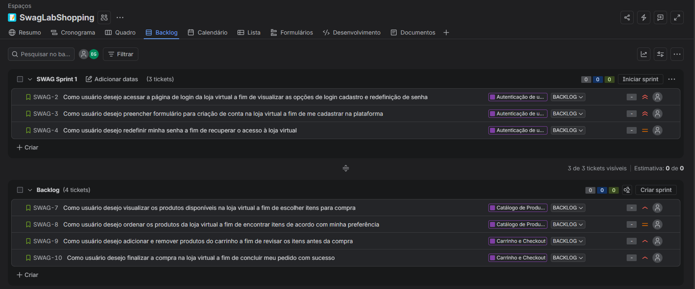

# Histórias de Usuário

## Contexto

Este documento registra o planejamento das histórias de usuário do projeto **SwagLabShopping**, utilizando como referência a aplicação [Sauce Demo](https://www.saucedemo.com/).

As histórias foram criadas no JIRA para simular o trabalho de refinamento de um time ágil, considerando a visão do cliente, o valor da funcionalidade, os requisitos esperados e os critérios de aceite. Os detalhes completos de cada história estão nos arquivos exportados do JIRA, disponíveis na pasta `evidencias/jira`.

## Base conceitual

As histórias de usuário foram planejadas seguindo a estrutura:

- **Como** persona ou tipo de usuário
- **Eu quero** ação ou funcionalidade desejada
- **Para** objetivo, benefício ou valor esperado.

Também foram considerados os princípios **3C**:

- **Cartão:** registro objetivo da necessidade
- **Conversa:** refinamento colaborativo com o time
- **Confirmação:** critérios de aceite para validar se a necessidade foi atendida.

Como apoio à qualidade das histórias, foi utilizado o conceito **INVEST**:

- Independente;
- Negociável;
- Valiosa;
- Estimável;
- Pequena;
- Testável.

## Épicos planejados

| Épico | Nome | Quantidade de histórias | Planejamento |
| --- | --- | ---: | --- |
| EPIC-001 | Autenticação de Usuário | 3 | SWAG Sprint 1 |
| EPIC-002 | Catálogo de Produtos | 2 | Backlog |
| EPIC-003 | Carrinho e Checkout | 2 | Backlog |

## Histórias por épico

### EPIC-001 - Autenticação de Usuário

| ID | História de usuário | Planejamento | Evidência |
| --- | --- | --- | --- |
| US-001 | Como usuário desejo acessar a página de login da loja virtual a fim de visualizar as opções de login cadastro e redefinição de senha | SWAG Sprint 1 | [User Story 1](../evidencias/jira/%5B%23SWAG-2%5D_User_Story_1.pdf) |
| US-002 | Como usuário desejo preencher formulário para criação de conta na loja virtual a fim de me cadastrar na plataforma | SWAG Sprint 1 | [User Story 2](../evidencias/jira/%5B%23SWAG-3%5D_User_Story_2.pdf) |
| US-003 | Como usuário desejo redefinir minha senha a fim de recuperar o acesso à loja virtual | SWAG Sprint 1 | [User Story 3](../evidencias/jira/%5B%23SWAG-4%5D_User_Story_3.pdf) |

### EPIC-002 - Catálogo de Produtos

| ID | História de usuário | Planejamento | Evidência |
| --- | --- | --- | --- |
| US-004 | Como usuário desejo visualizar os produtos disponíveis na loja virtual a fim de escolher itens para compra | Backlog | [User Story 4](../evidencias/jira/%5B%23SWAG-7%5D_User_Story_.pdf) |
| US-005 | Como usuário desejo ordenar os produtos da loja virtual a fim de encontrar itens de acordo com minha preferência | Backlog | [User Story 5](../evidencias/jira/%5B%23SWAG-8%5D_User_Story_5.pdf) |

### EPIC-003 - Carrinho e Checkout

| ID | História de usuário | Planejamento | Evidência |
| --- | --- | --- | --- |
| US-006 | Como usuário desejo adicionar e remover produtos do carrinho a fim de revisar os itens antes da compra | Backlog | [User Story 6](../evidencias/jira/%5B%23SWAG-9%5D_User_Story_6.pdf) |
| US-007 | Como usuário desejo finalizar a compra na loja virtual a fim de concluir meu pedido com sucesso | Backlog | [User Story 7](../evidencias/jira/%5B%23SWAG-10%5D_User_Story_7.pdf) |

## Quadro de Backlog no JIRA

No planejamento inicial, as histórias relacionadas ao épico EPIC-001 - Autenticação de Usuário foram adicionadas à SWAG Sprint 1. As histórias dos épicos EPIC-002 - Catálogo de Produtos e EPIC-003 - Carrinho e Checkout permaneceram no Backlog para refinamento e planejamento em sprints futuras.

## Observações para refinamento

As histórias podem ser ajustadas durante o refinamento do backlog, conforme novas regras de negócio, dúvidas do time ou riscos de qualidade sejam identificados. Neste repositório, o documento mantém apenas a visão consolidada das histórias e suas evidências, enquanto os detalhes de valor, narrativa, requisitos e critérios de aceite ficam centralizados nos arquivos exportados do JIRA.
