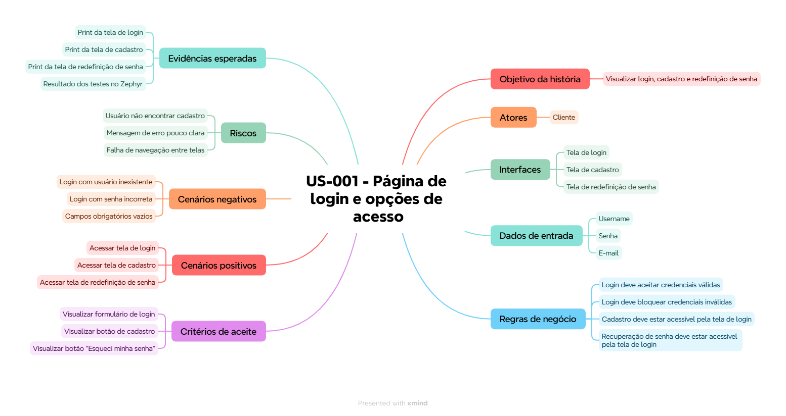

# Documentação de Testes

## Contexto

Este documento descreve a etapa de documentação de testes do projeto, contemplando mind map, plano de testes, casos de teste e ciclo de testes.
A ferramenta de gestão do projeto é o **JIRA**, com apoio do **Zephyr Essential** para gerenciamento de testes e do **XMind** para criação do mind map.

## História escolhida para mapeamento

A história escolhida para esta etapa foi:

```text
US-001 - Como usuário desejo acessar a página de login da loja virtual a fim de visualizar as opções de login cadastro e redefinição de senha
```

Essa história pertence ao épico:

```text
EPIC-001 - Autenticação de Usuário
```

Ela foi escolhida porque representa o primeiro contato do usuário com a loja virtual e concentra pontos importantes para teste funcional, como visualização de campos, navegação para cadastro, recuperação de senha e validação de credenciais.

## Mind map no XMind

### Objetivo

Criar uma visão visual da história escolhida, organizando comportamento esperado, cenários, dados, riscos e critérios de aceite.

### Resultado final



## Plano de testes

### Objetivo

Validar se o usuário consegue visualizar e utilizar corretamente as opções disponíveis na página de login da loja virtual, incluindo login, criação de conta e redefinição de senha.

### Escopo

Dentro do escopo:

- visualização da tela de login
- acesso à tela de cadastro
- acesso à tela de redefinição de senha
- validação de login com credenciais válidas
- validação de login com credenciais inválidas
- mensagens de erro relacionadas ao acesso.

Fora do escopo:

- testes automatizados
- testes de performance
- testes de segurança aprofundados
- validação real de envio de e-mail
- integração real com banco de dados em produção.

### Dados de teste

| Tipo de dado | Exemplo | Objetivo |
| --- | --- | --- |
| Usuário válido | `standard_user` | Validar login com sucesso |
| Senha válida | `secret_sauce` | Validar login com sucesso |
| Usuário inexistente | `usuario_inexistente` | Validar mensagem para conta não cadastrada |
| Senha inválida | `senha_errada` | Validar mensagem para senha incorreta |
| E-mail válido | `cliente@email.com` | Validar recuperação de senha |
| E-mail inválido | `cliente@email` | Validar tratamento de formato inválido |

### Riscos

| Risco | Impacto | Mitigação |
| --- | --- | --- |
| Usuário não identificar opção de cadastro | Médio | Validar clareza visual da tela |
| Mensagem de erro pouco objetiva | Médio | Validar textos exibidos nos cenários negativos |
| Login permitir credenciais inválidas | Alto | Executar casos negativos de autenticação |
| Redirecionamento incorreto | Alto | Validar navegação para cadastro e redefinição |
| Falha em Web Mobile | Médio | Executar validação visual em viewport mobile |

## Casos de teste planejados

| ID | Nome do caso | Tipo | História relacionada |
| --- | --- | --- | --- |
| CT-001 | Visualizar opções na página de login | Step-by-step | US-001 |
| CT-002 | Login com credenciais válidas | Step-by-step | US-001 |
| CT-003 | Cliente sem cadastro deseja criar uma conta | BDD/Gherkin | US-001 |
| CT-004 | Cliente informa credenciais inválidas | BDD/Gherkin | US-001 |

## Arquivos exportados e evidências

Para manter o repositório mais organizado, as evidências foram salvas na pasta `evidencias/`. Os arquivos exportados do JIRA, do XMind e do Zephyr funcionam como evidências complementares ao planejamento descrito neste documento.

| Artefato | Origem | Arquivo |
| --- | --- | --- |
| Casos de teste exportados | Zephyr Essential | [Casos de teste US-001](../evidencias/zephyr/Casos_de_teste_US_001.xlsx) |
| Plano de testes | Zephyr Essential | [Plano de testes US-001](../evidencias/zephyr/Plano_de_testes_US_001.png) |
| Ciclo de testes | Zephyr Essential | [Ciclo de testes US-001](../evidencias/zephyr/Ciclo_de_testes_US_001.png) |

## Referências

- SmartBear Zephyr Documentation - Test Plans: https://support.smartbear.com/zephyr/docs/en/test-plans/test-plans--overview-
- SmartBear Zephyr Essential Documentation: https://support.smartbear.com/zephyr-essential-dc/docs/en/welcome.html